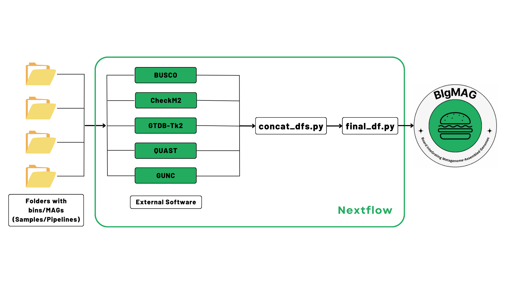

# BIgMAG
<p align="center">
    
</p>

BIgMAG (Board InteGrating Metagenome-Assembled Genomes) serves as both a pipeline to measure the quality of metagenomes through multiples pieces and dashboard to visualize the data generated during the analysis.

[](https://www.nextflow.io/)
[](https://docs.conda.io/en/latest/)
[](https://www.docker.com/)
[](https://sylabs.io/docs/)
[](https://plotly.com/)

## A bite you will not resist!
If you are curious how the dashboard looks like and check its layout even before starting to work with it, here there is a small bite of our BIgMAG:

https://github.com/jeffe107/BIgMAG/assets/91961180/6e3bc6bf-24fc-4050-b944-5bcf87bf35e6

## Installation

The pipeline runs under Nextflow DSL2, you can check how to install Nextflow [here](https://www.nextflow.io/docs/latest/install.html). Please notice that you need to have Java JDK (recommended version 17.0.3) available to be able to install Nextflow. 

To install BIgMAG, you just need to copy this repository:
```bash
 git clone https://github.com/jeffe107/BIgMAG.git 
```

## Pipeline summary

BIgMAG receives folders containing bins or MAGs in any format (.fna, .fa, .fasta) decompressed or compressed (.gz), and it is able to detect empty bins to prevent the analysis failing (they are kept inside the output directory if you want to check them). The files should be input following this structure:
```bash
.
└── samples/
    ├── sample1/
    │   ├── bin1
    │   ├── bin2
    │   └── ...
    ├── sample2/
    │   ├── bin1
    │   ├── bin2
    │   ├── bin3
    │   └── ... 
    └── ...
```
In addition, you can provide a .csv file with the names of the samples and the paths:

| sampleID      | files            |
| ------------- | ---------------- |
| sample1       | path/to/sample1  |
| sample2       | path/to/sample2  |
| ...           | ...              |

Please check in the Usage section to see how to input one or another.
> [!WARNING]
> Please make sure that all of the bins in the same folder have the same extension. Bins belonging to different samples can have different extensions.

<p align="center">
    
</p>

- examines completeness and contamination with [CheckM2](https://github.com/chklovski/CheckM2) v1.0.1 and [BUSCO](https://busco.ezlab.org/busco_userguide.html) v5.7.0.
- determines different metrics and statistics using [QUAST](https://quast.sourceforge.net/) v5.2.0.
- detects chimerism and contamination by running [GUNC](https://github.com/grp-bork/gunc) v1.0.6.
- optionally assigns taxonomy to bins using [GTDB-Tk2](https://ecogenomics.github.io/GTDBTk/index.html) v2.3.2.

Finally, a file named *final_df.tsv* will be generated and used to display the dashboard using [Dash and Plotly](https://dash.plotly.com/).

## Pipeline Usage
The basic usage of the pipeline can be achieved by running: 

If you want to test the proper behaviour of the pipeline you can just run:
```bash
 nextflow run BIgMAG/main.nf -profile test,<docker/singularity/podman/shifter/charliecloud/conda/mamba> --outdir <OUTDIR>
```
To run the pipeline with the default workflow:
```bash
 nextflow run BIgMAG/main.nf -profile <docker/singularity/podman/shifter/charliecloud/conda/mamba> --files 'path/to/the/samples/*' --outdir <OUTDIR>
```
In case you wish to input a csv file with the details of your samples, you can replace the flag `--files` for `--csv_files 'path/to/your/csv_files'`.
### Databases
Running the pipeline in its default state will attempt to download automaically CheckM2 (~3.5 GB) and GUNC (~12 GB) in your specified output directory. Please make sure you have enough space to store these databases. Moreover, if you have customized or different versions you would like to use, you can use these flags to include them `--gunc_db '/path/to/your/gunc_db.dmnd'` and `--checkm2_db '/path/to/your/checkm2_db.dmnd'`.

In the case of the database required by GTDB-Tk2, BIgMAG does not download by default given its large required space (~85 GB); however if you include the flag `--run_gtdbtk2` to both automatically download the database and run the analysis. As for CheckM2 and GUNC, you can input your own version of the database with `gtdbtk2_db '/pathto/to/your/gtdbtk/release*'`
> [!WARNING]
> Notice that when you *untar* any GTDB dabatase, it is stored under the name `release*`; please keep the word *release* in the name to guarantee a proper detection by the pipeline.

As mentioned before, the databases downloaded by the pipeline are store in your output directory inside a folder named `databases`, you may want to keep them for further runs of the pipeline and include them with the previously provided flags, speeding up the process.

### Profiles
The pipeline can use different techonologies to run the required software. The available profiles are:
- docker
- singularity
- podman 
- shifter 
- charliecloud
- conda
- mamba
- apptainer

Please select one of these considering your system configuration. Natively, the pipeline will pull the container from [quay.io](https://quay.io/). In the case of singularity and apptainer profiles, the pipeline will pull containers from [Galaxy project](https://depot.galaxyproject.org/singularity/).

Furthermore, if the execution of the pipeline fails while using profiles that require to mount directories, i.e. apptainer, throwing an error related with problems to find any file you can attempt to solve this by including the flag `--directory_to_bind 'path/to/the/directory'`.

Finally, when using mamba or conda as profiles, you may want to make sure you have only bioconda, conda-forge and defaults as available channels, in that order.
### Executors
In its default state, the pipeline will use the local executor to perform the requested tasks, this means that it will only attempt to use the available resources at the moment. Nonetheless, if you wish to take advantage from other executors as slurm, sge, bridge or cloud-based infrastructure such as AWS or Azure, you can include especific profiles to achieve this task (check the Nextflow documentation for [this](https://www.nextflow.io/docs/latest/executor.html#)). For instance, to allow slurm execution, you can modify the configuration of the general file by creating your own customized profile (uncommenting the line): 

https://github.com/jeffe107/BIgMAG/blob/244f2d9a783ff0ee4dc6971d376d2ad90be91cb8/nextflow.config#L50

Also, the pipeline, following nf-core directions, is able to check maximum resources can be requested in each system to allocate them to every job. You may want to check the file `conf/base.config` to change the resources provided to each process.
### Software parameters
#### BUSCO
By default BUSCO is going to use bacteria_odb10 lineage to search for SCO in the input bins. If you wish, to use a different lineage you can use the flag `--lineage 'your_preferred_lineage'` or even `--lineage 'auto_lineage'` to allow BUSCO automatically detecting the correct lineage (if your samples are too diverse, the *auto_lineage* strategy may fail). To append additional BUSCO parameters, please use the flag 
`--busco_options '--any_flag to_run_busco'`.
#### CheckM2, GTDB-Tk2 and GUNC
As for BUSCO, you can append additional parameters to these tools by:
- `--checkm2_options '--any_flag to_run_checkm2'`
- `--gtdbtk2_options '--any_flag to_run_gtdbtk2'`
- `--gunc2_options '--any_flag to_run_gunc'`
> [!WARNING]
> Please check the documentation of these tools before including any additional parameter.
#### QUAST
To analyze the bins using QUAST, there are two parameters set that you can modify at your convenience. The max-ref-number is set to 0 to prevent QUAST to try to download reference genomes from SILVA 16S rRNA database, and align against them aftewards. If you want to enable this feature, you can add the flag `--max_ref_number <N>` (N: number between 1 and 50). Please notice that this feature sometimes may fail depending on your system configuration. Moreover, you can modify the minimun contig length detection by including  `--min_contig <N>` in your command (the default value is 150).
### Output directory
In your especified output directory, you will find folders named accordingly to your input files, and inside these the output from each of the tools executed along with a folder containing the empty bins if found. In addition, you will see the afore-mentioned directory containing the databases, if downloaded by the pipeline. Inside a directory called *pipeline_info*, you will find the execution reports generated by Nextflow. Ultimately, you will see the file *final_df.tsv*, which is the main input to display the dashboard. 

## Dashboard
After the successful execution of the pipeline, you are ready to display the dashboard and start exploring your data. For this, you will need Conda, Mamba (recommended versions 23.3.1 and 1.3.1) or [pip](https://pip.pypa.io/en/stable/installation/) installed in your local system. You can create the environment or install the components with:
```bash
 pip install -r BIgMAG/requirements.txt 
```
or
```bash
 <conda/mamba> create -n BIgMAG --file BIgMAG/requirements.txt
 <conda/mamba> activate BIgMAG
```
After you have installed the required components, you can just run:
```bash
 BIgMAG/app.py -p <N> 'path/to/the/final_df.tsv' 
```
The flag `-p <N>` is included to display the dashboard in a port of your preference. Otherwise, the default value is `8050`.
Once you run the command, the prompt output will indicate you the IP direction that you must type on your browser or copy and paste onto it, i.e., `http://127.0.0.1:8050/`

### Layout

As depicted on our demo video, the layout is composed by 6 plots, being 5 of them clearly labeled to which tool they are related. The final plot *Metrics at a glance* is a clustergram representing how "similar" the samples/pipelines are based on the average metrics generated by BUSCO, CheckM2, GUNC and GTDB-Tk2.

### Practical tips
Even though both the pipeline and the dashboard are able to handle as many samples as you wish, for visualization purposes it is recommended to have maximum between 15 and 20 samples (we run out of colors). In addition, the names of the samples should be quite short (between 5 and 10 characters) for them no to occupy all of the space in each plot.

On the other hand, according to your screen and resolution the layout may be disorganized during the rendering process, you can adjust this by just reloading the page and zooming-in/out to readjust the plots. The correct display of the layout was tested on Chrome v124.0.6367.62 and Firefox v124.0.2.

Furthermore, you can download any plot from the dashboard by just clicking on the 📷 small icon in the upper right corner of each plot.

## Acknowledgments
Tool developed under the support of the *Federal Commission for Scholarships for Foreign Students* (FCS) through the program *Swiss Government Excellence Scholarships*.

## Citation
If you find BIgMAG useful, please cite us (paper on the way) or share this tool through platforms such as X and LinkedIn.
